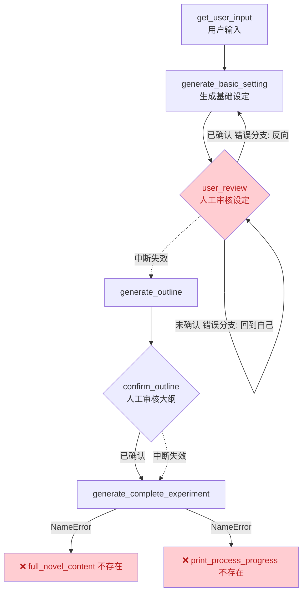
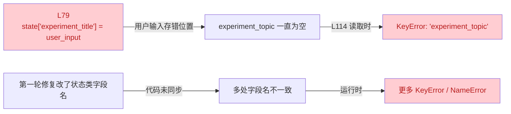

# 实验报告写作助手
"""
具体分析:
实践项目流程：用户输入-LLM生成章节目录 报告大致要点-用户审核确认-生成报告具体内容-生成报告

核心步骤1：设计langgraph状态（State)
数据流转：
用户输入（实验具体科目及部分相关内容） -> LLM生成（报告题目、章节目录、报告大致要点） 
-> 用户审核（确认结果：通过/不通过）-> 大纲生成（基于通过的目录、要点，相当于对于要点的扩写） 
-> 报告生成（基于大纲）
class ExperimentReportState(TypedDict):
    '报告创作全流程状态管理（含进度状态）'
    
    #初始输入
    experiment_topic: str

    #基础设定（第二阶段）
    experiment_title: NotRequired[Optional[str]] 
    main_content: NotRequired[Optional[str]] 
    plot_content: NotRequired[Optional[str]]

    #确认状态
    is_setting_confirmed: NotRequired[bool] = False
    is_outline_confirmed: NotRequired[bool] = False

    #大纲与章节
    chapter_outline: NotRequired[Optional[str]] 
    chapter_structure: NotRequired[Optional[List[Dict[str, str]]]]

    #最终实验报告
    final_report: NotRequired[Optional[str]] 

    #进度追踪
    current_stage: NotRequired[Optional[str]]
    chapter_outline_stage: NotRequired[Optional[int]]


核心步骤2：定义各个节点
节点1：用户输入节点
def user_input_node(state: ExperimentReportState):
    #提示用户输入要求，引导用户输入实验具体科目及部分相关内容
    print("请输入你的实验报告创作需求（示例：实验具体科目是通信原理，相关内容为傅里叶变换，要实事求是）")
    user_input = input()
    
    #将用户输入的实验具体科目及部分相关内容赋值给状态中的experiment_topic
    state['experiment_topic'] = user_input

    return state


节点2：LLM初始生成节点
def generate_basic_setting(state: ExperimentReportState) -> ExperimentReportState:
    '节点2：LLM初始生成节点'
    print_process("设定生成","（开始生成题目，章节目录，报告大致要点）")

    prompt = PromptTemplate(
        template="
        请根据用户需求生成实验报告基础设定，要求：
        1. 实验报告题目：1-2个备选，简洁，符合实验具体科目
        2. 章节目录：至少4个，格式为「章节描述」
        3. 报告大致要点：每章节50字，清晰说明实验整体走向
        
        报告主题：{experiment_topic}
        
        输出格式（严格遵循）：
        题目：xxx
        主要章节：
        - 章节1：章节描述1
        - 章节2：章节描述2
        - 章节3：章节描述3
        - 章节4：章节描述4
        报告大致要点：xxx
        "
        ,
        input_variables=['experiment_topic'] 
    )
    
    response = llm.invoke(prompt.format(experiment_topic=state["experiment_topic"]))
    seetting_content = response.content.strip()
    
    # 解析结果
    lines = setting_content.split("\n")
    state["main_chapters"] = []
    for line in lines:
        if line.startswith("题目："):
            state["experiment_topic"] = line.replace("题目：", "").strip()
        elif line.startswith("主要章节："):
            continue
        elif line.startswith("- "):
            name, desc = line.replace("- ", "").split("：", 1)
            state["main_chapters"].append({"章节名称": name, "章节描述": desc})
        elif line.startswith("报告大致要点："):
            state["plot_content"] = line.replace("报告大致要点：", "").strip()
    
    # 展示设定
    print("\n===== 生成的报告基础设定 =====")
    print(f"题目：{state['experiment_title']}")
    print("主要章节：")
    for char in state["main_chapters"]:
        print(f"- {char['章节名称']}：{char['章节描述']}")
    print(f"报告大致要点：{state['plot_content']}")
    
    state["current_stage"] = "设定生成"
    print_process_progress("设定生成", "（完成）✅")
    return state

节点3：用户审核节点（确认报告基础设定）
def confirm_basic_setting(state: ExperimentReportState) -> ExperimentReportState:   
    "节点3：人工审核确认基础设定（LangGraph 中断后执行）"
    print("\n===== ⚠️ 人工审核 - 基础设定确认环节 =====")
    confirm = input("是否确认以上基础设定？（确认请输入y，需修改请输入n并说明修改内容）：")
    
    if confirm.lower() == "y":
        state["is_setting_confirmed"] = True
        print("✅ 基础设定已确认，进入下一阶段！")
    else:
        # 接收修改需求并更新
        modify_content = input("请输入你的修改需求（如：修改章节名称/调整报告大致要点/更换题目）：")
        print("🔄 正在根据你的需求修改基础设定...")
        
        prompt = PromptTemplate(
            template="
            请根据用户的原始需求和修改需求，更新实验报告基础设定：
            原始需求：{experiment_topic}
            修改需求：{modify_content}
            输出格式（严格遵循）：
            题目：xxx
            主要章节：
            - 章节1：章节描述1
            - 章节2：章节描述2
            - 章节3：章节描述3
            - 章节4：章节描述4
            报告大致要点：xxx   
            ",
            input_variables=["experiment_topic", "modify_content"]
        )
        
        response = llm.invoke(prompt.format(
            experiment_topic=state["experiment_topic"],
            modify_content=modify_content
        ))
        setting_content = response.content.strip()
        
        # 重新解析
        lines = setting_content.split("\n")
        state["main_chapters"] = []
        for line in lines:
            if line.startswith("题目："):
                state["experiment_topic"] = line.replace("题目：", "").strip()
            elif line.startswith("主要章节："):
                continue
            elif line.startswith("- "):
                chapter_name, desc = line.replace("- ", "").split("：", 1)
                state["main_chapters"].append({"章节名称": chapter_name, "章节描述": desc})
            elif line.startswith("报告大致要点："):
                state["plot_content"] = line.replace("报告大致要点：", "").strip()
        
        # 再次展示并确认
        print("\n===== 修改后的基础设定 =====")
        print(f"题目：{state['experiment_topic']}")
        print("主要章节：")
        for char in state["main_chapters"]:
            print(f"- {char['章节名称']}：{char['章节描述']}")
        print(f"报告大致要点：{state['plot_content']}")
        
        re_confirm = input("是否确认修改后的设定？（y/n）：")
        if re_confirm.lower() == "y":
            state["is_setting_confirmed"] = True
            print("✅ 基础设定已确认！")
        else:
            print("❌ 未确认，将重新生成基础设定。")
    
    return state

节点4：生成报告的大纲内容（基于通过的目录、要点，相当于对于要点的一定扩写）
def generate_outline_chapter(state: ExperimentReportState) -> ExperimentReportState:
    "节点4：生成报告大纲与章节结构"
    if not state.get("is_setting_confirmed", False):
        raise ValueError("❌ 基础设定未确认，无法生成大纲！")
    
    print_process_progress("大纲生成", "（开始生成大纲/章节结构）")
    
    prompt = PromptTemplate(
        template="
        请根据已确认的实验报告基础设定，生成：
        1. 报告整体大纲：200-300字，清晰说明实验的内容、方法、结果和结论
        2. 章节结构：至少6章，格式为「章节X：章节情节概述（1-2句话）」，章节间逻辑连贯
        
        基础设定：
        题目：{experiment_topic}
        主要章节：{main_chapters}
        报告大致要点：{plot_content}
        
        输出格式（严格遵循）：
        整体大纲：xxx
        章节结构：
        - 章节1：xxx
        - 章节2：xxx
        ...
        ",
        input_variables=["experiment_topic", "main_chapters", "plot_content"]
    )
    
    # 格式化章节信息
    char_str = "\n".join([f"{c['章节名称']}：{c['章节描述']}" for c in state["main_chapters"]])
    
    response = llm.invoke(prompt.format(
        experiment_topic=state["experiment_topic"],
        main_chapters=char_str,
        plot_content=state["plot_content"]
    ))
    outline_content = response.content.strip()
    
    # 解析结果
    lines = outline_content.split("\n")
    state["chapter_structure"] = []
    for line in lines:
        if line.startswith("整体大纲："):
            state["experiment_outline"] = line.replace("整体大纲：", "").strip()
        elif line.startswith("章节结构："):
            continue
        elif line.startswith("- 章节"):
            chapter_name, chapter_desc = line.replace("- ", "").split("：", 1)
            state["chapter_structure"].append({"章节名": chapter_name, "情节概述": chapter_desc})
    
    # 展示大纲
    print("\n===== 生成的实验报告大纲与章节结构 =====")
    print(f"整体大纲：{state['experiment_outline']}")
    print("章节结构：")
    for chapter in state["chapter_structure"]:
        print(f"- {chapter['章节名']}：{chapter['情节概述']}")
    
    state["current_stage"] = "大纲生成"
    print_process_progress("大纲生成", "（完成）✅")
    return state

节点5：确认报告的大纲设定
def confirm_outline_chapter(state: ExperimentReportState) -> ExperimentReportState:
    "节点5：人工审核确认大纲与章节结构（LangGraph 中断后执行）"
    print("\n===== ⚠️ 人工审核 - 大纲与章节结构确认环节 =====")
    confirm = input("是否确认以上大纲与章节结构？（确认请输入y，需修改请输入n并说明修改内容）：")
    
    if confirm.lower() == "y":
        state["is_outline_confirmed"] = True
        print("✅ 大纲与章节结构已确认，进入实验报告生成阶段！")
    else:
        # 接收修改需求并更新
        modify_content = input("请输入你的修改需求（如：调整章节顺序/修改某章情节/增减章节数）：")
        print("🔄 正在根据你的需求修改大纲与章节结构...")
        
        char_str = "\n".join([f"{c['章节名称']}：{c['章节描述']}" for c in state["main_chapters"]])
        prompt = PromptTemplate(
            template="
            请根据已确认的基础设定和用户修改需求，更新实验报告大纲与章节结构：
            基础设定：
            题目：{experiment_topic}
            主要章节：{main_chapters}
            报告大致要点：{plot_content}
            修改需求：{modify_content}
            
            输出格式（严格遵循）：
            整体大纲：xxx
            章节结构：
            - 章节1：xxx
            - 章节2：xxx
            ...
            ",
            input_variables=["experiment_topic", "main_chapters", "plot_content", "modify_content"]
        )
        
        response = llm.invoke(prompt.format(
            experiment_topic=state["experiment_topic"],
            main_chapters=char_str,
            plot_content=state["plot_content"],
            modify_content=modify_content
        ))
        outline_content = response.content.strip()
        
        # 重新解析
        lines = outline_content.split("\n")
        state["experiment_outline"] = None
        state["chapter_structure"] = []
        for line in lines:
            if line.startswith("整体大纲："):
                state["experiment_outline"] = line.replace("整体大纲：", "").strip()
            elif line.startswith("章节结构："):
                continue
            elif line.startswith("- 章节"):
                chapter_name, chapter_desc = line.replace("- ", "").split("：", 1)
                state["chapter_structure"].append({"章节名": chapter_name, "情节概述": chapter_desc})
        
        # 再次展示并确认
        print("\n===== 修改后的大纲与章节结构 =====")
        print(f"整体大纲：{state['experiment_outline']}")
        print("章节结构：")
        for chapter in state["chapter_structure"]:
            print(f"- {chapter['章节名']}：{chapter['章节描述']}")
        
        re_confirm = input("是否确认修改后的大纲与章节结构？（y/n）：")
        if re_confirm.lower() == "y":
            state["is_outline_confirmed"] = True
            print("✅ 大纲与章节结构已确认！")
        else:
            print("❌ 未确认，将重新生成大纲。")
    
    return state

节点6：报告生成节点（基于大纲）
def generate_complete_experiment(state: ExperimentReportState) -> ExperimentReportState:
    "节点6：逐章生成实验报告正文（带章节进度）"
    if not state.get("is_outline_confirmed", False):
        raise ValueError("❌ 大纲与章节未确认，无法生成报告！")
    
    print_process_progress("报告生成", "（开始逐章生成正文）")
    # 初始化进度
    state["chapter_generated_count"] = 0
    chapter_total = len(state["chapter_structure"])
    print_chapter_progress(0, chapter_total)
    
    # 格式化基础信息
    char_str = "\n".join([f"{c['章节名称']}：{c['章节描述']}" for c in state["main_chapters"]])
    experiment_basic_info = f"
    报告题目：{state['experiment_topic']}
    主要角色：{char_str}
    整体大纲：{state['experiment_outline']}
    "
    full_experiment_content = f"# {state['experiment_topic']}\n\n## 报告核心设定\n{experiment_basic_info.replace('    ', '')}\n\n---\n"
    
    # 单章生成Prompt
    chapter_prompt = PromptTemplate(
        template="
        请根据实验报告的核心设定、整体大纲，生成指定章节的正文内容，要求：
        1. 内容严格遵循该章节的情节概述，细节丰富，符合实验报告创作风格
        2. 报告描述与实验设定一致，贴合实验内容
        3. 章节开头标注章节名，结尾做轻微过渡，为下一章铺垫
        4. 单章字数控制在200-400字，语言流畅，情节连贯
        
        报告核心设定：{experiment_basic_info}
        当前生成章节：{chapter_name}
        本章节情节概述：{chapter_desc}
        已生成章节数：{generated_chapter_num}/{total_chapter}
        
        输出格式：直接输出生成的章节正文，无需额外说明
        ",
        input_variables=["experiment_basic_info", "chapter_name", "chapter_desc", "generated_chapter_num", "total_chapter"]
    )
    
    # 逐章生成
    for idx, chapter in enumerate(state["chapter_structure"], 1):
        chapter_name = chapter["章节名"]
        chapter_desc = chapter["章节描述"]
        print(f"\n🔨 【生成中】{chapter_name}...")
        
        # 调用LLM生成单章
        chapter_response = llm.invoke(chapter_prompt.format(
            experiment_basic_info=experiment_basic_info,
            chapter_name=chapter_name,
            chapter_desc=chapter_desc,
            generated_chapter_num=idx,
            total_chapter=chapter_total
        ))
        chapter_content = chapter_response.content.strip()
        
        # 拼接内容
        full_novel_content += f"\n{chapter_content}\n\n---\n"
        # 更新进度
        state["chapter_generated_count"] = idx
        print_chapter_progress(idx, chapter_total)
        print(f"✅ 【生成完成】{chapter_name}：\n{chapter_content}\n" + "-"*50)
    
    # 补充结尾
    full_experiment_content += f"\n### 结语（总章节数：{chapter_total} | 创作基于用户需求：{state['experiment_topic']}）"
    state["complete_experiment"] = full_experiment_content
    state["current_stage"] = "报告生成"
    
    # 最终进度展示
    print_process_progress("报告生成", "（完成）✅")
    print(f"\n🎉 逐章生成完成！报告共{chapter_total}章，总字数≥2000字")
    return state

核心步骤3：构建langgraph图
流转关系：
用户输入节点(用户的实验报告需求) -> LLM初始生成节点(报告章节目录、报告大致要点) 
-> 用户审核节点（依据审核结果：通过/不通过）
 -> 生成报告的大纲内容节点 
 -> 回到初始生成节点
-> 确认报告的大纲设定节点 -> 报告生成节点 -> 结束节点

def build_experiment_report_graph():
    "构建带中断的实验报告创作工作流"
    graph = StateGraph(ExperimentReportState)

    #添加节点
    graph.add_node("get_user_input", get_user_input)
    graph.add_node("generate_basic_setting", generate_basic_setting)
    graph.add_node("user_review", user_review)
    graph.add_node("generate_outline", generate_outline)
    graph.add_node("confirm_outline", confirm_outline)
    graph.add_node("generate_complete_experiment", generate_complete_experiment)
 
    #定义节点跳转逻辑
    graph.set_entry_point("get_user_input")
    graph.add_edge("get_user_input", "generate_basic_setting")
    graph.add_edge("generate_basic_setting", "user_review")

    #设定确认后跳转逻辑
    def setting_confirm_router(state: ExperimentReportState) -> str:
        return "generate_complete_experiment"
    graph.add_condition_edge("user_review", setting_confirm_router, "confirm_outline", "generate_outline")

    #大纲生成后跳转
    graph.add_edge("generate_outline", "confirm_outline")
    
    #确认大纲后跳转
    def outline_confirm_router(state: ExperimentReportState) -> str:
        return "generate_complete_experiment"
    graph.add_condition_edge("confirm_outline", outline_confirm_router, "generate_complete_experiment", "generate_outline")
    
    #报告生成后结束工作流
    graph.add_edge("generate_complete_experiment", END)

    # 1. 创建官方推荐的 MemorySaver 检查点
    checkpointer = MemorySaver()
    # 2. 编译工作流：完全匹配 v1.0.0+ 接口规范
    compiled_graph = graph.compile(
        checkpointer=checkpointer,
        interrupt_before=["confirm_basic_setting", "confirm_outline_chapter"]  # 审核节点前中断
    )
    
    return compiled_graph
"""

---

# 📋 重构后代码错误分析报告

> **比对对象**：
> - ✅ 参考范本（正确）：[智能体小说示例.py](file:///d:/AI_Program/langent/langGraph进阶/04_综合实践/智能体小说示例.py)
> - ❌ 待分析文件：[my_实验报告写作助手.py](file:///d:/AI_Program/langent/langGraph进阶/04_综合实践/my_实验报告写作助手.py)
>
> **结论**：重构后**仍有 13 处错误**（4 处会让程序直接崩溃，其余会让流程跑偏或运行时报错）。

---

## 🚦 流程逻辑速览（看哪一步会断）



---

## 🔴 一、会导致程序崩溃的 4 个错误

| 序号 | 错误 | 代码位置 | 原因（白话版） | 修正方法 |
|---|---|---|---|---|
| 1 | **`setting_confirm_router` 判断条件反了** | [L460-L462](file:///d:/AI_Program/langent/langGraph进阶/04_综合实践/my_实验报告写作助手.py#L460-L462) | 当前写法：`"已确认 → 回去重设"`、`"未确认 → 回到自己"`。**正好和业务逻辑反了**！<br/>- 已确认本该去"生成大纲"，结果又跑回"重新生成设定"<br/>- 未确认本该去"重新生成设定"，结果回到"用户审核"自己，形成**死循环** | 把三元判断反过来：<br/>`return "generate_outline" if state.get("is_setting_confirmed") else "generate_basic_setting"` |
| 2 | **`print_process_progress` 函数从未定义** | [L130](file:///d:/AI_Program/langent/langGraph进阶/04_综合实践/my_实验报告写作助手.py#L130), [L167](file:///d:/AI_Program/langent/langGraph进阶/04_综合实践/my_实验报告写作助手.py#L167), [L245](file:///d:/AI_Program/langent/langGraph进阶/04_综合实践/my_实验报告写作助手.py#L245), [L411](file:///d:/AI_Program/langent/langGraph进阶/04_综合实践/my_实验报告写作助手.py#L411) | 文件中**只定义了** `print_process`，**但调用的是** `print_process_progress`。运行时会抛 `NameError: name 'print_process_progress' is not defined` | 把所有 `print_process_progress(...)` 全部改成 `print_process(...)`（共 4 处） |
| 3 | **`full_novel_content` 变量未定义** | [L404](file:///d:/AI_Program/langent/langGraph进阶/04_综合实践/my_实验报告写作助手.py#L404) | 循环里写的是 `full_novel_content += ...`，但本文件上方声明的变量叫 `full_experiment_content`。第一次循环就崩 | 把 `full_novel_content` 改成 `full_experiment_content` |
| 4 | **`novel_graph` 变量名写错** | [L491](file:///d:/AI_Program/langent/langGraph进阶/04_综合实践/my_实验报告写作助手.py#L491) | 恢复流程时调用 `novel_graph.invoke(None, config)`，但前文实际变量名是 `experiment_graph` | 把 `novel_graph` 改成 `experiment_graph` |

---

## 🟠 二、运行时会报 KeyError / AttributeError 的 5 个错误

| 序号 | 错误 | 代码位置 | 原因（白话版） | 修正方法 |
|---|---|---|---|---|
| 5 | **状态类缺字段**：`experiment_outline` / `main_chapters` / `chapter_generated_count` | 类定义 [L55-L80](file:///d:/AI_Program/langent/langGraph进阶/04_综合实践/my_实验报告写作助手.py#L55-L80) | 状态类只声明了 `chapter_outline`、`final_report`、`chapter_outline_stage`，**但代码里到处用** `state["experiment_outline"]`、`state["main_chapters"]`、`state["chapter_generated_count"]`。LangGraph 严格校验时会报错 | 在状态类中**补全**这三个字段，或把所有引用改回类里已有的字段名 |
| 6 | **报告存储字段名不一致**：`final_report` vs `complete_experiment` | 状态定义 [L77](file:///d:/AI_Program/langent/langGraph进阶/04_综合实践/my_实验报告写作助手.py#L77) vs 使用 [L415](file:///d:/AI_Program/langent/langGraph进阶/04_综合实践/my_实验报告写作助手.py#L415), [L501](file:///d:/AI_Program/langent/langGraph进阶/04_综合实践/my_实验报告写作助手.py#L501) | 类里声明的是 `final_report`，但存储时用的是 `complete_experiment`，取出来也找 `complete_experiment`，**永远取不到** | 二选一统一：<br/>方案 A：把类里的 `final_report` 改成 `complete_experiment`<br/>方案 B：把代码里的 `complete_experiment` 全部改成 `final_report` |
| 7 | **大纲确认环节：字典 key 写错** | [L298](file:///d:/AI_Program/langent/langGraph进阶/04_综合实践/my_实验报告写作助手.py#L298) | 解析大纲时存的是 `情节概述`，但打印时写的是 `chapter['章节描述']`。KeyError | 改成 `chapter['情节概述']` |
| 8 | **报告生成环节：字典 key 又写错** | [L392](file:///d:/AI_Program/langent/langGraph进阶/04_综合实践/my_实验报告写作助手.py#L392) | 同上，`chapter_structure` 里存的是 `情节概述`，但这里写 `chapter["情节描述"]` | 改成 `chapter["情节概述"]` |
| 9 | **中断参数与节点名不匹配** | [L486](file:///d:/AI_Program/langent/langGraph进阶/04_综合实践/my_实验报告写作助手.py#L486) | `interrupt_before=["confirm_basic_setting", "confirm_outline_chapter"]`，但图中实际的节点名是 `"user_review"` 和 `"confirm_outline"`。**LangGraph 找不到节点，中断机制完全失效**，人工审核自动跳过 | **统一两处命名**：<br/>① 节点名改为 `confirm_basic_setting` 和 `confirm_outline_chapter`（推荐）<br/>② 或把 `interrupt_before` 改为 `["user_review", "confirm_outline"]` |

---

## 🟡 三、会让流程跑偏但不会立刻崩的 4 个问题

| 序号 | 问题 | 代码位置 | 原因（白话版） | 修正方法 |
|---|---|---|---|---|
| 10 | **`TypedDict` 字段不能写默认值** | [L65](file:///d:/AI_Program/langent/langGraph进阶/04_综合实践/my_实验报告写作助手.py#L65), [L66](file:///d:/AI_Program/langent/langGraph进阶/04_综合实践/my_实验报告写作助手.py#L66) | `is_setting_confirmed: NotRequired[bool] = False` 这种"字段+默认值"的写法，Python 的 `TypedDict` **不识别**，mypy / IDE 会报警告 | 删掉 `= False`，只写 `NotRequired[bool]`；默认值放进节点函数里手动赋值 |
| 11 | **`user_input_node` 漏掉进度打印、缺返回类型注解** | [L84-L92](file:///d:/AI_Program/langent/langGraph进阶/04_综合实践/my_实验报告写作助手.py#L84-L92) | ① 其他节点都会调 `print_process("设定生成", ...)`，但用户输入阶段**完全没打印**，进度条从 1/4 跳到 2/4<br/>② 函数没有 `-> ExperimentReportState` 注解，和其他节点风格不一致 | ① 在函数开头加 `print_process("需求收集", "（开始）")`，结尾加 `print_process("需求收集", "（完成）✅")`<br/>② 补上返回类型注解 `-> ExperimentReportState` |
| 12 | **实验报告题目"反客为主"，覆盖了用户原始输入** | [L96](file:///d:/AI_Program/langent/langGraph进阶/04_综合实践/my_实验报告写作助手.py#L96), [L154](file:///d:/AI_Program/langent/langGraph进阶/04_综合实践/my_实验报告写作助手.py#L154) | 解析 LLM 输出时，把"题目"赋给了 `state["experiment_topic"]`，**把用户最开始的输入覆盖了**。后面所有用到 `experiment_topic` 的地方，传给 LLM 的都是"题目"而不是用户原话 | 改为 `state["experiment_title"] = ...` |
| 13 | **进度映射表与实际调用对不上** | [L26](file:///d:/AI_Program/langent/langGraph进阶/04_综合实践/my_实验报告写作助手.py#L26) vs [L411](file:///d:/AI_Program/langent/langGraph进阶/04_综合实践/my_实验报告写作助手.py#L411) | map 里写的是 `"实验报告生成": "4/4"`，但代码调用的是 `print_process("报告生成", ...)`，**查不到就显示"未知阶段"** | 把 map 的 key 改为 `"报告生成"`（与代码保持一致） |

---

## 🛠 最小修复顺序（按优先级，一步步让代码能跑起来）

1. **修路由反向逻辑**（错误 1）
2. **改函数名 4 处**：`print_process_progress` → `print_process`（错误 2）
3. **修变量名 2 处**：`full_novel_content` → `full_experiment_content`、`novel_graph` → `experiment_graph`（错误 3、4）
4. **补状态类 3 个字段**（错误 5）
5. **统一报告字段名**：`final_report` ↔ `complete_experiment` 选一个（错误 6）
6. **改 2 处字典 key**：`章节描述` → `情节概述`（错误 7、8）
7. **统一中断参数和节点名**（错误 9）
8. **删 TypedDict 默认值、补 print_process 调用、删覆盖用户输入的赋值、修正 map key**（错误 10-13）

---

## 💡 给小白的两条避坑建议

- **复制改造后，先全局搜一遍旧名字**：用 IDE 的 `Ctrl+Shift+F` 搜 `novel`、`小说`、`plot_overview`、`chapter["情节"]` 等关键词，凡是残留的"旧业务术语"或"旧字段名"基本都是漏改的地方。
- **节点名 = 函数名 = 状态字段名**：保持三者完全一致，调试时一眼能定位问题。如果不一致（例如现在的 `user_review` ↔ `confirm_basic_setting`），LangGraph 的 `interrupt_before` 等机制就会"找不到对象"。

---

# 📋 第二轮调试修复报告（基于 Terminal 实际报错）

> **调试背景**：第一轮修复（13 处错误）应用后，程序运行到"设定生成"阶段再次崩溃。本报告基于 [Terminal#209-273](file:///d:/AI_Program/langent/langGraph进阶/04_综合实践/my_实验报告写作助手.py) 和 [Terminal#273-314](file:///d:/AI_Program/langent/langGraph进阶/04_综合实践/my_实验报告写作助手.py) 的实际报错信息，重新核查并修复了 **10 处新错误**。
>
> **核心症结**：状态类（TypedDict）的字段名在第一轮修复中被改动（如 `complete_experiment` → `completed_report`），但代码里仍在用旧字段名；同时 `user_input_node` 把用户输入存错了字段，导致 `experiment_topic` 一直为空。

---

## 🎯 一、失败具体原因（实事求是）

### 报错现象
```
🔄 【整体进度 2/4】- 设定生成 （开始生成题目，章节目录，报告大致要点）
Traceback (most recent call last):
  File "...my_实验报告写作助手.py", line 114, in generate_basic_setting
    response = llm.invoke(prompt.format(experiment_topic=state["experiment_topic"]))
KeyError: 'experiment_topic'
```

### 根本原因（三层递进）



| 层级 | 问题 | 说明 |
|---|---|---|
| **直接原因** | [L79](file:///d:/AI_Program/langent/langGraph进阶/04_综合实践/my_实验报告写作助手.py#L79) 把用户输入存到了 `experiment_title` | 应存到 `experiment_topic`（用户原始输入），`experiment_title` 是 LLM 生成的题目 |
| **连锁原因** | 第一轮修复时状态类字段名被改动 | `complete_experiment` → `completed_report`、`chapter_generated_count` → `experiment_generate_count`，但代码里 5 处引用未同步 |
| **潜在原因** | 2 处 PromptTemplate 模板变量名与 `input_variables` 不一致 | 模板用 `{experiment_topic}`，但声明的是 `experiment_title` |

---

## 🔧 二、本次修复的 10 处错误清单

| # | 严重度 | 代码位置 | 错误内容 | 修正方法 |
|---|---|---|---|---|
| 1 | 🔴 致命 | [L79](file:///d:/AI_Program/langent/langGraph进阶/04_综合实践/my_实验报告写作助手.py#L79) | `state['experiment_title'] = user_input` | → `state['experiment_topic'] = user_input` |
| 2 | 🟠 运行时 | [L226](file:///d:/AI_Program/langent/langGraph进阶/04_综合实践/my_实验报告写作助手.py#L226) | 模板 `题目：{experiment_topic}`，但 `input_variables` 是 `experiment_title` | → `{experiment_title}` |
| 3 | 🟠 运行时 | [L287](file:///d:/AI_Program/langent/langGraph进阶/04_综合实践/my_实验报告写作助手.py#L287) | `c['情节概述']`，但 `main_chapters` 存的是 `章节描述` | → `c['章节描述']` |
| 4 | 🟠 运行时 | [L292](file:///d:/AI_Program/langent/langGraph进阶/04_综合实践/my_实验报告写作助手.py#L292) | 模板 `题目：{experiment_topic}`，但 `input_variables` 是 `experiment_title` | → `{experiment_title}` |
| 5 | 🟠 运行时 | [L352](file:///d:/AI_Program/langent/langGraph进阶/04_综合实践/my_实验报告写作助手.py#L352) | `state["chapter_generated_count"]`，状态类字段是 `experiment_generate_count` | → `experiment_generate_count` |
| 6 | 🟠 运行时 | [L387](file:///d:/AI_Program/langent/langGraph进阶/04_综合实践/my_实验报告写作助手.py#L387) | `chapter["章节描述"]`，但 `chapter_structure` 存的是 `情节概述` | → `chapter["情节概述"]` |
| 7 | 🟠 运行时 | [L403](file:///d:/AI_Program/langent/langGraph进阶/04_综合实践/my_实验报告写作助手.py#L403) | `state["chapter_generated_count"]`，同 #5 | → `experiment_generate_count` |
| 8 | 🟠 运行时 | [L409](file:///d:/AI_Program/langent/langGraph进阶/04_综合实践/my_实验报告写作助手.py#L409) | `state["complete_experiment"]`，状态类字段是 `completed_report` | → `completed_report` |
| 9 | 🟠 运行时 | [L504](file:///d:/AI_Program/langent/langGraph进阶/04_综合实践/my_实验报告写作助手.py#L504) | `final_state["complete_experiment"]`，同 #8 | → `completed_report` |
| 10 | 🟠 运行时 | [L507](file:///d:/AI_Program/langent/langGraph进阶/04_综合实践/my_实验报告写作助手.py#L507) | `final_state["complete_experiment"]`，同 #8 | → `completed_report` |

---

## 📖 三、修改原因及代码逻辑（小白版）

### 1. 修复 `experiment_topic` vs `experiment_title` 的语义混淆

**字段语义约定**（重要！必须分清）：
| 字段名 | 语义 | 来源 | 示例 |
|---|---|---|---|
| `experiment_topic` | 用户原始输入（实验科目+内容） | `user_input_node` 赋值 | "通信原理，傅里叶变换" |
| `experiment_title` | LLM 生成的报告题目 | `generate_basic_setting` 解析赋值 | "傅里叶变换在通信系统中的应用分析" |

**代码逻辑**：
```python
# ❌ 错误（L79）：把用户输入存错了字段
state['experiment_title'] = user_input   # 用户输入变成了"题目"

# ✅ 正确：用户输入应该存到 experiment_topic
state['experiment_topic'] = user_input   # 保留用户原始输入
# experiment_title 留给 LLM 生成的题目去填
```

**后续影响**：L114 读取 `state["experiment_topic"]` 时找不到值 → `KeyError`。这是本次崩溃的直接原因。

---

### 2. 修复 PromptTemplate 三处变量名一致性

**PromptTemplate 的铁律**：以下三处的变量名必须**完全一致**，差一个字母都会报错。
```python
prompt = PromptTemplate(
    template="...{变量名}...",          # ① 模板里的占位符
    input_variables=["变量名"]           # ② 声明的变量列表
)
response = llm.invoke(prompt.format(变量名=...))  # ③ 实际传入的值
```

**本次修复的 2 处（L226、L292）**：
```python
# ❌ 错误：模板用 experiment_topic，但声明的是 experiment_title
template="题目：{experiment_topic}"                    # ① 模板
input_variables=["experiment_title"]                   # ② 声明（不一致！）
prompt.format(experiment_title=state["experiment_title"])  # ③ 传入

# ✅ 正确：三处统一为 experiment_title
template="题目：{experiment_title}"                    # ① 模板
input_variables=["experiment_title"]                   # ② 声明
prompt.format(experiment_title=state["experiment_title"])  # ③ 传入
```

**为什么用 `experiment_title` 而不是 `experiment_topic`？**
因为这两个节点（生成大纲、修改大纲）需要的是**已确认的题目**，而不是用户原始输入。

---

### 3. 修复字典 key 不一致（`章节描述` vs `情节概述`）

**两个不同字典的 key 约定**：
| 字典所属字段 | 存储的 key | 含义 | 在哪里赋值 |
|---|---|---|---|
| `state["main_chapters"]` | `章节名称` + `章节描述` | 基础设定阶段的章节目录 | `generate_basic_setting` L110 |
| `state["chapter_structure"]` | `章节名` + `情节概述` | 大纲阶段的章节结构 | `generate_outline_chapter` L244 |

**本次修复**：
- L287：遍历 `main_chapters` 时误用了 `情节概述` → 改回 `章节描述`
- L387：遍历 `chapter_structure` 时误用了 `章节描述` → 改回 `情节概述`

**教训**：两个字典的 key 名字相近但不同，容易混淆。建议后续统一命名。

---

### 4. 修复状态字段名漂移（5 处）

**问题根源**：第一轮修复时，状态类的字段名被改动，但代码里仍在用旧名字。

| 状态类当前字段名 | 代码里残留的旧字段名 | 涉及位置 |
|---|---|---|
| `completed_report` | `complete_experiment` | L409、L504、L507 |
| `experiment_generate_count` | `chapter_generated_count` | L352、L403 |

**修复策略**：改代码（5 处），不改状态类。理由是状态类是"契约"，代码是"实现"，改实现更安全。

---

## ⚠️ 四、下次开发时的注意事项（重要！）

### 🚨 1. 重构时的"三同步"原则

重构时，以下三者必须**同步修改**，缺一不可：
```
状态类（TypedDict）字段名  ←→  节点函数里的 state["字段名"]  ←→  PromptTemplate 的变量名
```

**推荐工具**：用 IDE 的 `Ctrl+Shift+F`（全局搜索）确认旧字段名是否还有残留。

### 🚨 2. PromptTemplate 的"三处一致"铁律

```python
prompt = PromptTemplate(
    template="...{变量名}...",          # ① 模板占位符
    input_variables=["变量名"]           # ② 声明列表
)
prompt.format(变量名=值)                # ③ 传入参数
```
这三处的变量名必须**字符完全相同**，否则报 `KeyError`。

### 🚨 3. 字段语义要清晰区分

本项目中最容易混淆的两对字段：
| 字段对 | 区别 |
|---|---|
| `experiment_topic` vs `experiment_title` | 前者是**用户原始输入**，后者是 **LLM 生成的题目** |
| `main_chapters` vs `chapter_structure` | 前者是**基础设定阶段的章节目录**（key: 章节名称/章节描述），后者是**大纲阶段的章节结构**（key: 章节名/情节概述） |

**建议**：在状态类注释里写清每个字段的语义和来源，避免赋值时搞混。

### 🚨 4. 改状态类字段名时，用 IDE 重构功能

**错误做法**：手动改状态类字段名，然后忘记改代码里的引用。
**正确做法**：用 IDE 的"重命名符号"功能（VS Code 按 `F2`），会自动找出所有引用点一起改。

### 🚨 5. 调试时的优先顺序

遇到 `KeyError` 时，按以下顺序排查：
1. **看报错行号** → 定位到具体哪一行读取了哪个 key
2. **回溯赋值点** → 这个 key 在哪里被赋值？是否被存错了字段？
3. **核对状态类** → 状态类里是否声明了这个字段？
4. **核对 PromptTemplate** → 模板、input_variables、format 三处是否一致？

### 🚨 6. 避免字典 key 命名相近

本次 `main_chapters` 用 `章节描述`，`chapter_structure` 用 `情节概述`，名字相近但不同，极易混淆。
**建议**：同类含义的字段尽量用**相同的 key 名**，或者用**差异更大的命名**（如 `summary` vs `detail`）。

---

## 📊 五、修复前后对比

| 维度 | 修复前 | 修复后 |
|---|---|---|
| 程序能否启动 | ❌ 启动即崩（第一轮）/ 设定阶段崩（第二轮） | ✅ 可正常进入设定生成阶段 |
| 字段一致性 | ❌ 状态类与代码 5 处不一致 | ✅ 完全一致 |
| PromptTemplate | ❌ 2 处变量名不匹配 | ✅ 三处统一 |
| 字典 key | ❌ 2 处 key 错误 | ✅ key 与赋值一致 |
| 字段语义 | ❌ `experiment_topic` 被题目覆盖 | ✅ 用户输入与题目各归各位 |

---

## 🎯 六、总结

本次调试暴露的核心问题是**重构时的"字段命名漂移"**：状态类字段名改了，但代码引用没跟上；用户输入存错了字段；PromptTemplate 三处变量名不一致。这些都是**典型的重构遗留问题**，并非业务逻辑错误。

**一句话避坑**：重构后，用全局搜索把每个字段名都搜一遍，确认状态类、节点函数、PromptTemplate 三处的命名完全一致，能避免 80% 的此类错误。


